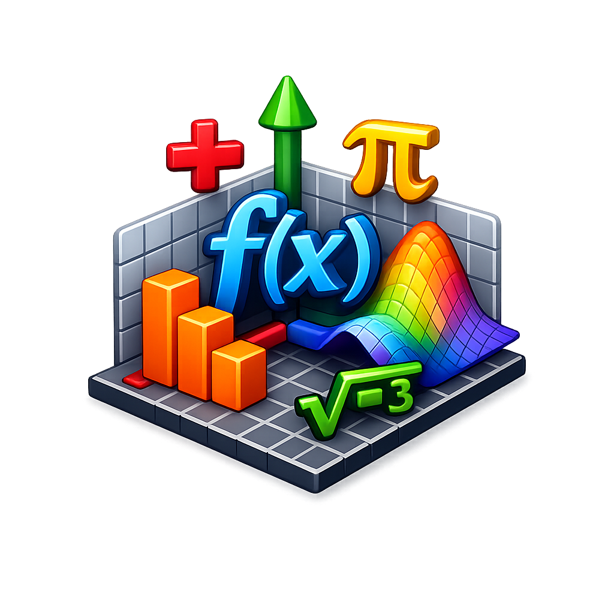

# Interactive 3D Visualization of Mathematical Functions

<p align="center">
  
</p>

<p align="center">
  A real-time, interactive 3D surface visualizer built for exploring mathematical functions — with parameter control, transformations, animation, and a custom equation engine.
</p>

---

## Table of Contents

- [Features](#features)
- [System Architecture](#system-architecture)
- [Project Structure](#project-structure)
- [Module Descriptions](#module-descriptions)
- [Application Workflow](#application-workflow)
- [Tech Stack](#tech-stack)
- [Setup & Run Locally](#setup--run-locally)
- [Deployment](#deployment)

---

## Features

- **8 preset mathematical surfaces** — Paraboloid, Sin·Cos, Gaussian, Saddle, Ripple, Wave, Egg Carton, Monkey Saddle
- **Custom equation engine** — type any expression using `x`, `y`, `a` with natural syntax (`^` for power, implicit multiplication)
- **Real-time parameter control** — slider for parameter `a` updates the surface instantly
- **3D transformations** — Z-scale, Z-offset, XY rotation (core computer graphics concepts)
- **Animated parameter sweeps** — smooth morphing with play/pause and a scrubber slider
- **Interactive Plotly 3D** — rotate, zoom, pan with mouse; colormap and contour options
- **Light / Dark theme** — clean glassmorphism UI, responsive for desktop, tablet, mobile
- **10 quick-pick example equations** — one click to load and plot

---

## System Architecture

```
┌─────────────────────────────────────────────────────────────────┐
│                        BROWSER (Client)                         │
│   Plotly.js 3D canvas  ·  Streamlit frontend  ·  CSS/HTML UI   │
└──────────────────────────────┬──────────────────────────────────┘
                               │  WebSocket (Streamlit protocol)
┌──────────────────────────────▼──────────────────────────────────┐
│                      main.py  (Streamlit App)                   │
│                                                                 │
│  ┌─────────────┐  ┌──────────────┐  ┌────────────────────────┐ │
│  │  Sidebar UI │  │  CSS Theming │  │  Visualization Logic   │ │
│  │  (controls) │  │  (inject_css)│  │  (Plotly chart render) │ │
│  └──────┬──────┘  └──────────────┘  └───────────┬────────────┘ │
│         │                                        │              │
│         ▼                                        ▼              │
│  ┌─────────────────────────────────────────────────────────┐    │
│  │                   CORE LAYER (Python)                   │    │
│  │                                                         │    │
│  │  ┌─────────────────┐  ┌──────────────┐  ┌───────────┐  │    │
│  │  │ grid_generator  │  │ function_    │  │ transfor- │  │    │
│  │  │                 │  │ engine       │  │ mations   │  │    │
│  │  │ • generate_grid │  │ • registry   │  │ • scale   │  │    │
│  │  │ • resolution    │  │ • compute    │  │ • rotate  │  │    │
│  │  │   presets       │  │ • custom eval│  │ • offset  │  │    │
│  │  └────────┬────────┘  └──────┬───────┘  └─────┬─────┘  │    │
│  │           │                  │                 │        │    │
│  │           ▼                  ▼                 ▼        │    │
│  │        NumPy mesh ───► Z = f(X,Y,a) ───► Transformed Z │    │
│  │                                                         │    │
│  └─────────────────────────────────────────────────────────┘    │
│         │                                                       │
│         ▼                                                       │
│  ┌─────────────────────────────────────────────────────────┐    │
│  │               RENDERING LAYER                           │    │
│  │                                                         │    │
│  │  ┌──────────────────┐  ┌─────────────────────────────┐  │    │
│  │  │ plotly_renderer  │  │ parameter_animation         │  │    │
│  │  │ • surface figure │  │ • parameter sweep generator │  │    │
│  │  │ • animation      │  │ • smooth interpolation      │  │    │
│  │  │   frames         │  │ • bounce / loop modes       │  │    │
│  │  └──────────────────┘  └─────────────────────────────┘  │    │
│  └─────────────────────────────────────────────────────────┘    │
└─────────────────────────────────────────────────────────────────┘
```

### Layer Responsibilities

| Layer | Module | Responsibility |
|-------|--------|----------------|
| **UI** | `main.py` | Streamlit page config, sidebar controls, CSS theming, layout, visualization rendering |
| **Core** | `core/grid_generator.py` | Generates 2D NumPy mesh grids with configurable range and resolution |
| **Core** | `core/function_engine.py` | Function registry (8 presets + custom), safe expression evaluator with `eval()` in a restricted NumPy namespace |
| **Core** | `core/transformations.py` | Z-axis scaling, Z-axis translation, XY-plane rotation — demonstrates CG transformation matrices |
| **Rendering** | `rendering/plotly_renderer.py` | Builds interactive Plotly 3D `Surface` figures, applies light/dark theme tokens, generates animation frames |
| **Animation** | `animations/parameter_animation.py` | Produces parameter sweep arrays (linear, bounce, cosine ease) for smooth surface morphing |

---

## Project Structure

```
Project CGV/
├── main.py                          # Streamlit app entry point
├── icon.png                         # App favicon and logo
├── requirements.txt                 # Python dependencies
├── Procfile                         # Heroku process definition
├── runtime.txt                      # Python version for Heroku
├── .gitignore
│
├── .streamlit/
│   └── config.toml                  # Streamlit server config
│
├── core/                            # Computation layer
│   ├── __init__.py
│   ├── grid_generator.py            # Mesh grid generation
│   ├── function_engine.py           # Function registry + custom eval
│   └── transformations.py           # Scale, rotate, translate
│
├── rendering/                       # Visualization layer
│   ├── __init__.py
│   └── plotly_renderer.py           # Plotly 3D surface + animations
│
└── animations/                      # Animation utilities
    ├── __init__.py
    └── parameter_animation.py       # Parameter sweep generation
```

---

## Module Descriptions

### `core/grid_generator.py`

Generates a 2D mesh grid using `numpy.meshgrid`. Accepts configurable X/Y ranges and resolution (points per axis). Includes device-based resolution presets (desktop: 100, tablet: 75, mobile: 50).

### `core/function_engine.py`

Central function registry mapping display names to callables. Contains 8 hardcoded mathematical surfaces plus a "Custom Equation" sentinel entry. The custom evaluator:

1. Strips and preprocesses the expression (`^` → `**`, implicit multiplication)
2. Builds a restricted namespace with NumPy math functions and `__builtins__` set to `{}`
3. Evaluates via `eval()` and broadcasts scalar results to grid shape
4. Returns clear `ValueError` messages for syntax errors, unknown names, or division by zero

### `core/transformations.py`

Implements three fundamental CG transformations:

- **Scale** — multiplies Z values by a factor
- **Translate** — adds an offset along Z
- **Rotate** — applies a 2D rotation matrix to the X-Y grid around the Z axis

### `rendering/plotly_renderer.py`

Builds Plotly `go.Surface` figures with:

- Neutral light/dark theme tokens (background, grid, font colors)
- Colorbar, contour projection, opacity controls
- Animation frame generation with play/pause buttons and a slider scrubber

### `animations/parameter_animation.py`

Generates parameter value arrays for animation:

- **Linear sweep** — uniform steps from start to end
- **Bounce** — forward + reverse for looping
- **Cosine ease** — smooth ease-in-out interpolation

---

## Application Workflow

```
User opens app
      │
      ▼
┌─────────────────────────┐
│  1. SELECT FUNCTION     │  Choose from 8 presets or "Custom Equation"
│     (sidebar dropdown)  │  Custom: type expression, click examples
└───────────┬─────────────┘
            │
            ▼
┌─────────────────────────┐
│  2. ADJUST PARAMETERS   │  Parameter a, grid resolution, X/Y range,
│     (sidebar sliders)   │  colormap, contour, transformations
└───────────┬─────────────┘
            │
            ▼
┌─────────────────────────┐
│  3. GENERATE GRID       │  grid_generator creates X, Y mesh arrays
│     (NumPy meshgrid)    │  Resolution: 20–150 points per axis
└───────────┬─────────────┘
            │
            ▼
┌─────────────────────────┐
│  4. COMPUTE SURFACE     │  Preset: function_engine.compute_surface()
│     (function engine)   │  Custom: evaluate_custom_expression(expr)
└───────────┬─────────────┘
            │
            ▼
┌─────────────────────────┐
│  5. APPLY TRANSFORMS    │  scale_surface(Z, factor)
│     (transformations)   │  translate_surface(Z, offset)
└───────────┬─────────────┘  rotate_surface_z(X, Y, angle)
            │
            ▼
┌─────────────────────────┐
│  6. RENDER 3D PLOT      │  plotly_renderer builds go.Surface figure
│     (Plotly)            │  Applies theme, colormap, contour settings
└───────────┬─────────────┘
            │
            ├──── Static mode: single interactive 3D surface
            │
            └──── Animation mode: parameter sweep frames
                  with play/pause controls and slider
            │
            ▼
┌─────────────────────────┐
│  7. DISPLAY IN BROWSER  │  Streamlit renders Plotly chart
│     (Streamlit)         │  User can rotate, zoom, pan with mouse
└─────────────────────────┘
```

### Custom Equation Flow

```
User types "x^2 + 2y"
        │
        ▼
  Preprocessor:
    "x^2 + 2y"  →  "x**2 + 2*y"
        │
        ▼
  Safe eval() with restricted namespace:
    { x: X_grid, y: Y_grid, a: param,
      sin, cos, exp, sqrt, pi, e, ...
      __builtins__: {} }
        │
        ▼
  Returns Z array  →  same pipeline as presets
```

---

## Tech Stack

| Component | Technology | Purpose |
|-----------|-----------|---------|
| **Language** | Python 3.12 | Core computation and app logic |
| **Numerical** | NumPy | Mesh grid generation, array math |
| **Visualization** | Plotly | Interactive 3D surface rendering |
| **Web Framework** | Streamlit | Reactive UI, sidebar controls, layout |
| **Styling** | Custom CSS | Glassmorphism theme (light + dark) |
| **Hosting** | Heroku / Streamlit Cloud | Deployment via GitHub |

---

## Setup & Run Locally

```bash
# Clone the repository
git clone https://github.com/Surajnpfr/CGVProject.git
cd CGVProject

# Install dependencies
pip install -r requirements.txt

# Run the app
streamlit run main.py --server.headless=true
```

The app will be available at **http://localhost:8501**.

---

## Deployment

### Heroku (via GitHub)

1. Create a new app on [dashboard.heroku.com](https://dashboard.heroku.com)
2. Connect to the GitHub repo
3. Deploy branch `main`
4. The `Procfile` and `runtime.txt` handle the rest automatically

### Streamlit Community Cloud (Free)

1. Go to [share.streamlit.io](https://share.streamlit.io)
2. Sign in with GitHub
3. Point to this repo, branch `main`, file `main.py`
4. Click Deploy

---

<p align="center">
  <strong>Interactive 3D Visualization of Mathematical Functions</strong><br>
  Computer Graphics Academic Project
</p>
